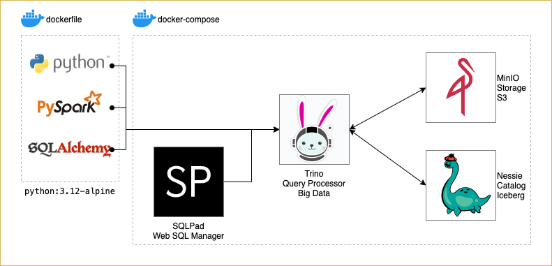
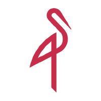
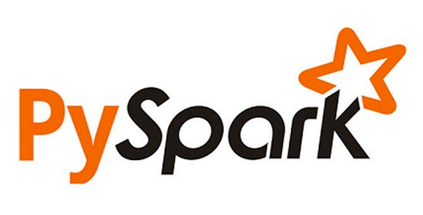
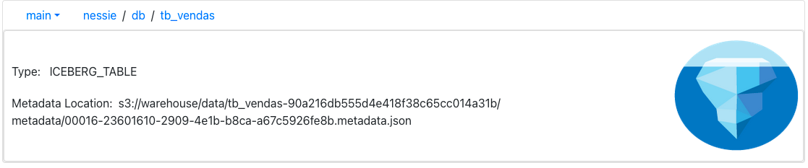
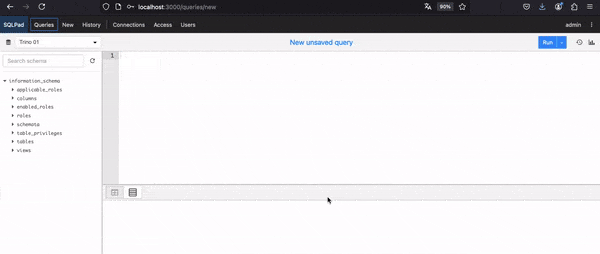
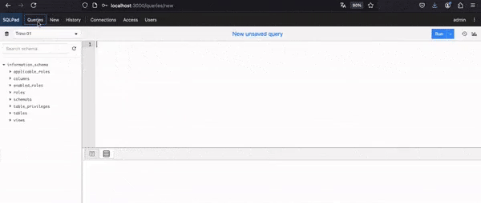
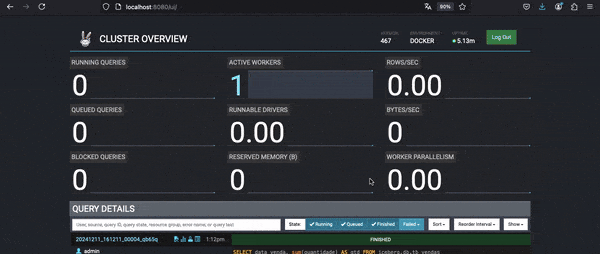
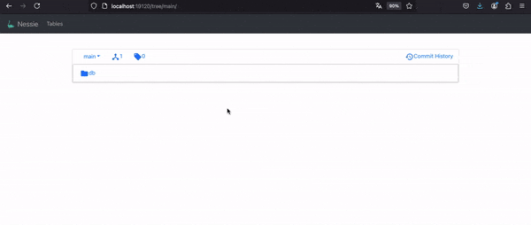
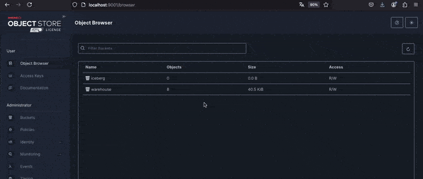

# Iceberg local com Trino + Nessie + MinIO
Neste projeto apresento uma alternativa para simular arquitetura de Big Data e arquivos S3 localmente.  

Para que fique claro sobre a extenção flexibilidade da solução, adicionando ainda nesse projeto endpoints no FastAPI pra execução dos Métodos e um tutorial para executar querys diretamente no SQLPad.

O consumo de dados no formato **S3 Iceberg** que é praticamente uma solução absoluta quando se trata de armazenamento e leitura de arquivos distribuídos em cenários de alto volume de dados.

Entretando para economizar em pesquisa em desenvolvimento, existe hoje alternativas para disponibilizar S3 Iceberg localmente com leitura de dados em SQL.

> Claro que cada solução e ferramenta possuem caracteristicas únicas que não serão identificas á AWS, havendo até algums desvantagens que detalho mais para frente. 

Mesmo assim, vejo aqui já um grande avanço nesse sentido. Acredito que no futuro, teremos ainda mais soluções OPEN SOURCE padronizadas (próximas) das soluções de mercado existentes para atender aos requisitos de migração e multi-cloud.

### Como instalar
* Necessário ter Docker e Docker-compose (ou Podman + Podman Compose) instalado
* Utilizar o comando `docker-compose up` ou `podman-compose up` no diretório do repositório
* Aplicação roda em [http://0.0.0.0:8000/](http://0.0.0.0:8000/) ou [http://localhost:8000/](http://localhost:8000/) por padrão
* Verificar da API [documentação](http://localhost:8000/docs): ([http://localhost:8000/docs](http://localhost:8000/docs))

#### Serviços instalados em container
  - **Trino**: http://localhost:8080/
    > _user: `admin`_
  - **Nessie**: http://localhost:19120
    > _user: `admin`, password: `password`_
  - **MinIO** http://localhost:9001/
    > _user: `admin`, password: `password`_
  - **SQLPad**: http://localhost:3000/
    > _user**: `admin`, password: `admin`_
  - **FastAPI**: http://localhost:8000/
    > _no autentication_

# Arquitetura


**TRINO** se destaca como **Query Processor de Big Data**. Ele se conecta ao **MinIO** para persistir os dados em formato **S3 (armazenamento distribuído)** e o **Nessie** que gerencia o **catalogo** dos arquivos armazenados em formato Iceberg.

As plataformas/ferramentas que manipulam os dados (**PySpark** e **SQLPad**) também devem se conectar ao **TRINO** para fazer uso da arquitura de Big Data no fomato de arquivos S3 Iceberg.
E assim, temos de modo democatico recursos do "S3 Iceberg" localmente.

Como o projeto também esta em **Docker** com algum ajuste é totalmente possível escalar para kubernets.

| :city_sunrise: |Aplicação| O que é|
|-----|:-----:|-------------|
|  | **[MinIO](https://min.io/docs/minio/container/operations/installation.html)**| Solução robusta para armazenamento de dados não estruturados, compatível com o protocolo S3 da AWS.|
|  | **[Nessie](https://projectnessie.org/)** | Ajuda na organização dos catalogos, schemas e tabelas. Oferece versionamento para os objetos, com criação de branches e tags. |
|  | **[Trino](https://trino.io/docs/current/installation/containers.html)** |  Nossa estrela do show. Mecanisco de consulta de SQL distribuído, permite executar consultar em tempo real sobre diversas fontes de dados NoSQL. |
|  | **[FastAPI](https://fastapi.tiangolo.com/#example)** | Framework Python, usado para criar APIs RESTful com facilidade e velocidade. |
|  | **[PySpark](https://spark.apache.org/docs/latest/api/python/index.html)** | Interface Python para o Apache Spark, usada para processamento distribuído de grandes volumes de dados em cluster |
|  | **[SQLPad](https://getsqlpad.com/en/introduction/)** | Manager de consultas SQL, possui diversos conectores. Permite colaboração de querys e dashborads via interface web|
|  | **[Docker](https://www.docker.com/get-started/)** | Plataforma para criar, distribuir e executar aplicações em contêineres isolados.|
|  | **[Podman](https://podman.io/get-started)** | Alternativa para executar container em relação ao Docker. Porém consume menos recursos de máquina no desenvolvimento local ***(super recomendo!)*** :rocket:.|

### Resumo do conjunto...

  A reunião dos 3 principais componentes (**Trino** + **Nessie** + **MinIO**) nos permite *"simular"* o de ambiente de armazenamento e processamento distribuído localmente (com menos recursos).

  

  No meu caso, por exemplo, minha CPU possui apenas 8GB de RAM. E foi possível realizar testes de menor escala para experimentar a tecnologia de processamento distribuído que geralmente exige um hardware mais pesado.

### Demais protagonistas

  Fiz uso das biblitecas em **Python**: **FastAPI**, **PySpark**, **SqlAlquemy** e PyTrino. Elas executam a manipulação dos dados.

  **PODMAN** foi totalmente relevante para esse projeto. Uma alernativa ao **DOCKER** instalar container com menos recurso de máquina que o Docker. Claro que existe *diferença de arquitetura entre PODMAN x DOCKER*, porém, para desenvolvimento local, percebi vantagem considerável no uso **PODMAN**. Como falei minha máquina tem apenas 8GB.

  **SQLPad** ajuda a apresentar um caso de uso mais direto e simples de como consumir a arquitetura de Big Data com Trino.

## Como usar...

1. **Instalar a imagem**
  Estando no diretório do projeto, com Docker:
   ```
   docker-compose up
   ```
   ... ou Podman:
   ```
   podman-compose up
   ```

2. **Leia a documentação em Swagger**

  Documentação: [htpp://localhost:8000/docs](htpp://localhost:8000/docs)

3. **Execute os testes disponiveis no Swagger**

   É essencial ter resultado como "TUDO OK""
   [IMAGEM GIF dos testes]

4. **Uso com SQLPad**

   Acesse http://localhost:3000
   > user `admin`, passord: `admin`

   As query já estão armazenadas no projeto e são acesseiveis pelo meno "Querys" na parte superior.

   Execute  "1. Query START!" para criar Schema `db`, Tabela `vendas` (particionada por ANO, MES e DIA) em formato S3 Iceberg e inserir dados.
     

   Após selecionar a query, clique no botão "RUN" na parte superior a direita, para executar. 

   **Visualize o relatório**

   Agora selecione a query "3. Vendas por dia".
   

5. **Monitore as querys executadas no Trino**
   Acesse http://localhost:8080
   > user `admin`
  
   Todas as querys executadas ficam registras em log no Trino.

   

6. **Visualize o catalogo Iceberg gerado pelo Nessie**
   Acesse http://localhost:17070
   > user `admin`, password: `password`
   
   Verifique aqui que o formato da tabela realmente esta como Iceberg. Todas as alterações no catalogo são registradas como commits.

   
 
7. **Visualize os arquivos gerado no S3 pelo MinIO**
   > user `admin`, password: `password`
   
   O observe que o particionamento é feito por separação de diretórios em ANO, MÊS e DIA
   


## Conclusão
Como nem tudo são flores... Não foi possível conectar o SPARK diretamente ao NESSIE+MINIO (o que traria maior performance). Embora exista documentação na página do desenvolvedor. Depois de muitos testes *(acredite! muitos!)*. Concluí que até pode ser uma possíbilidade, entretanto no ambiente local com praticamente 1 core executando em cada aplicação e poquissíma mémoria para esse tipo de aplicação, não foi possivel experimentar os demais cenários com hardware mais potente. Então foi mais fácil conectar no Trino.

A pesquisa sobre a solução do S3 iceberg num ambiente local foi que mais me consumiu tempo e esforço. Principalmente porque as ferramentas OPEN SOURCE disponíveis ainda não estão complementa maduradas e são promissoras. Porém ainda existem muitos bugs a serem corrigidos e recursos a serem desenvovidos por isso o uso delas deve ser com cautela.

Me diverti! Penso que é conhecimento rico que me provoca pensar em futuros esforços como o de migração de dados considerando o multi-cloud.

~~Colocar mais diagramas de arquietura com detalhes de cada etapa de conectivide.~~

### References
- https://medium.com/@faruk13/alpine-slim-bullseye-bookworm-noble-differences-in-docker-images-explained-d9aa6efa23ec
- https://getsqlpad.com/en/configuration/?id=backend-database-management#application-configuration-general

#### Comandos de container com PODMAN
- podman build -t python-alpine .
  * Constroi imagem a partir de um arquivo docker: `-t` atributo para informar a tag da imagem
- podman run -it python-alpine
  * Executa a imagem de forma interativa: `-it` atributo para ser interativo
- podman run -p 8000:8000 --replace --name python-alpine python-alpine
  * Executa a imagem: `-relace` substitui o container caso já existe algum com o mesmo nome, `--name` define o nome do container
- podman stats -a --no-stream 
  * Monitora os containers ativos: `-a` todos, `--no-stream`, relatório statico.
- podman ps
  * lista container disponíveis
- podman logs <container_id>
  * visualiza logs do container


